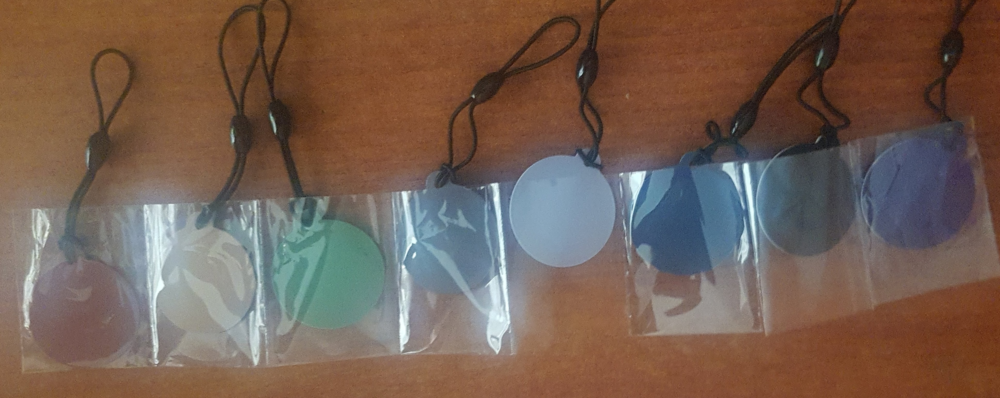

<h1 align="center">
  Fudi NFC
</h1>

[](https://developer.android.com/index.html)
[](https://android-arsenal.com/api?level=19)
[](https://github.com/romellfudi/FudiNFC/blob/master/LICENSE)
[](https://bintray.com/romllz489/maven/fudi-nfc) 
[![Data Studio](https://img.shields.io/badge/Data%20Studio-Downloads-%23000000.svg?&style=flat&logo=data%3Aimage%2Fsvg%2Bxml%3Bbase64%2CPHN2ZyBpZD0iTGF5ZXJfMSIgZGF0YS1uYW1lPSJMYXllciAxIiB4bWxucz0iaHR0cDovL3d3dy53My5vcmcvMjAwMC9zdmciIHZpZXdCb3g9IjAgMCAxMDcuNDcgMTAwIj48ZGVmcz48c3R5bGU%2BLmNscy0xe2ZpbGw6IzY2OWRmMzt9LmNscy0ye2ZpbGw6IzFhNzNlODt9PC9zdHlsZT48L2RlZnM%2BPHBhdGggY2xhc3M9ImNscy0xIiBkPSJNOTQuMDcsNzIuNzVINTVjLTkuNDYsMC0xNC43Myw2LjU5LTE0LjczLDEzLjYyQzQwLjIyLDkyLjc1LDQ0LjYyLDEwMCw1NSwxMDBoMzguOVY3Mi43NVoiLz48ZWxsaXBzZSBjbGFzcz0iY2xzLTIiIGN4PSI5NC4wNyIgY3k9Ijg2LjE1IiByeD0iMTMuNDEiIHJ5PSIxMy42MyIvPjxwYXRoIGNsYXNzPSJjbHMtMSIgZD0iTTUzLjYzLDM2LjI2SDE0LjczQzUuMjcsMzYuMjYsMCw0Mi44NiwwLDQ5Ljg5YzAsNi4zNyw0LjQsMTMuNjMsMTQuNzMsMTMuNjNoMzguOVoiLz48ZWxsaXBzZSBjbGFzcz0iY2xzLTIiIGN4PSI1My42MyIgY3k9IjQ5Ljg5IiByeD0iMTMuNDEiIHJ5PSIxMy42MyIvPjxwYXRoIGNsYXNzPSJjbHMtMSIgZD0iTTk0LjA3LDBINTVDNDUuNDksMCw0MC4yMiw2LjU5LDQwLjIyLDEzLjYzYzAsNi4zNyw0LjQsMTMuNjIsMTQuNzMsMTMuNjJoMzguOVYwWiIvPjxlbGxpcHNlIGNsYXNzPSJjbHMtMiIgY3g9Ijk0LjA3IiBjeT0iMTMuNjMiIHJ4PSIxMy40MSIgcnk9IjEzLjYzIi8%2BPC9zdmc%2B)](https://datastudio.google.com/reporting/fa311638-0e9b-4621-89ae-485ee4de5032)
[](https://jitpack.io/#romellfudi/FudiNFC)
[](./README.es)
[]( https://android-arsenal.com/details/1/8121 )

<!-- START doctoc generated TOC please keep comment here to allow auto update -->
<!-- DON'T EDIT THIS SECTION, INSTEAD RE-RUN doctoc TO UPDATE -->



- [Fudi NFC](#)
  - [Author Romell Domínguez](#author-romell-domínguez)
  - [Downloads Dashboard](#downloads-dashboard)
  - [How to read tags](#how-to-read-tags)
  - [How to write into tags](#how-to-write-into-tags)
  - [How to obtain tags' MAC](#how-to-obtain-tags-mac)
  - [License](#license)

<!-- END doctoc generated TOC please keep comment here to allow auto update -->
## Author Romell Domínguez
[](https://www.romellfudi.com/)


## Downloads Dashboard
[![Data Studio](https://img.shields.io/badge/DATA%20STUDIO-DOWNLOADS%20REPORT-%23000000.svg?&style=for-the-badge&logo=data%3Aimage%2Fsvg%2Bxml%3Bbase64%2CPHN2ZyBpZD0iTGF5ZXJfMSIgZGF0YS1uYW1lPSJMYXllciAxIiB4bWxucz0iaHR0cDovL3d3dy53My5vcmcvMjAwMC9zdmciIHZpZXdCb3g9IjAgMCAxMDcuNDcgMTAwIj48ZGVmcz48c3R5bGU%2BLmNscy0xe2ZpbGw6IzY2OWRmMzt9LmNscy0ye2ZpbGw6IzFhNzNlODt9PC9zdHlsZT48L2RlZnM%2BPHBhdGggY2xhc3M9ImNscy0xIiBkPSJNOTQuMDcsNzIuNzVINTVjLTkuNDYsMC0xNC43Myw2LjU5LTE0LjczLDEzLjYyQzQwLjIyLDkyLjc1LDQ0LjYyLDEwMCw1NSwxMDBoMzguOVY3Mi43NVoiLz48ZWxsaXBzZSBjbGFzcz0iY2xzLTIiIGN4PSI5NC4wNyIgY3k9Ijg2LjE1IiByeD0iMTMuNDEiIHJ5PSIxMy42MyIvPjxwYXRoIGNsYXNzPSJjbHMtMSIgZD0iTTUzLjYzLDM2LjI2SDE0LjczQzUuMjcsMzYuMjYsMCw0Mi44NiwwLDQ5Ljg5YzAsNi4zNyw0LjQsMTMuNjMsMTQuNzMsMTMuNjNoMzguOVoiLz48ZWxsaXBzZSBjbGFzcz0iY2xzLTIiIGN4PSI1My42MyIgY3k9IjQ5Ljg5IiByeD0iMTMuNDEiIHJ5PSIxMy42MyIvPjxwYXRoIGNsYXNzPSJjbHMtMSIgZD0iTTk0LjA3LDBINTVDNDUuNDksMCw0MC4yMiw2LjU5LDQwLjIyLDEzLjYzYzAsNi4zNyw0LjQsMTMuNjIsMTQuNzMsMTMuNjJoMzguOVYwWiIvPjxlbGxpcHNlIGNsYXNzPSJjbHMtMiIgY3g9Ijk0LjA3IiBjeT0iMTMuNjMiIHJ4PSIxMy40MSIgcnk9IjEzLjYzIi8%2BPC9zdmc%2B)](https://datastudio.google.com/reporting/fa311638-0e9b-4621-89ae-485ee4de5032)


`latestVersion` is 

Add the following in your app's `build.gradle` file:

```groovy
repositories {
    jcenter()
}
dependencies {
    implementation 'com.romellfudi.fudinfc:fudi-nfc:${latestVersion}'
}
```

Add the following to your AndroidManifest.xml file :
```xml
<uses-permission android:name="android.permission.NFC" />
```

Now go to the created activity, and either

* Implement [FGD] yourself

```kotlin
// write email
OpCallback { it.writeEmailToTagFromIntent(text, null, null, intent) }

// write sms message
OpCallback { it.writeSmsToTagFromIntent(text, null, intent) }

// write geolocation - latitude & longitude
OpCallback { it.writeGeolocationToTagFromIntent(latitude, longitude, intent) } 

// write uri
OpCallback { it.writeUriToTagFromIntent(text, intent) }

// write phone contact
OpCallback { it.writeTelToTagFromIntent(text, intent) }

// write rolling-on bluetooth device
OpCallback { it.writeBluetoothAddressToTagFromIntent(text, intent) }
```

## How to read tags

Paste this in the activity if you're **extending our class** :

```kotlin
override fun onNewIntent(Intent intent) {
    super.onNewIntent(intent) 
    for (String message in getNfcMessages()) { 
        // message 
    }
}
```

* Otherwise :

```kotlin
override fun onNewIntent(intent: Intent?) {
    super.onNewIntent(intent)
    val items: SparseArray<String> = NfcReadUtilityImpl().readFromTagWithSparseArray(intent)
    for (i in 0 until items.size()) {
        // items.valueAt(i) 
    }
}
```
* If you like the Map implementation more you might as well use :

```kotlin
override fun onNewIntent(intent: Intent?) {
    super.onNewIntent(intent)
    for (message in NfcReadUtilityImpl().readFromTagWithMap(intent).values()) {
        // message
    }
}
```

* Now you're able to read the NFC Tags as long as the library supports the data in it when held to your phone!

## How to write into tags
* Let your activity implement `TaskCallback`:


```kotlin
fun onReturn(result: Boolean) {
    val message = if (result) "Success" else "Failed!"
    Toast.makeText(this, message, Toast.LENGTH_SHORT).show()
}

fun onProgressUpdate(vararg booleans: Boolean) {
    Toast.makeText(this, if (booleans[0]) "We started writing" else "We could not write!", Toast.LENGTH_SHORT).show()
}

fun onError(e: Exception) {
    Toast.makeText(this, e.message, Toast.LENGTH_SHORT).show()
}
```

## How to obtain tags' MAC
```kotlin
fun getMAC(tag: Tag): String{
    val byteArrayToHexString = String.format("%0" + (tag.id.size * 2).toString() + "X", BigInteger(1, tag.id))
    val regex = Regex("(.{2})")
    return regex.replace(byteArrayToHexString, "$1:").dropLast(1)
}
```

* If you hold a tag near by the phone and NFC is Enabled, your implementation of the methods will be executed.

<p align="center"></p>

## License
```
Copyright 2020 Romell D.Z.

Licensed under the Apache License, Version 2.0 (the "License");
you may not use this file except in compliance with the License.
You may obtain a copy of the License at

http://www.apache.org/licenses/LICENSE-2.0

Unless required by applicable law or agreed to in writing, software
distributed under the License is distributed on an "AS IS" BASIS,
WITHOUT WARRANTIES OR CONDITIONS OF ANY KIND, either express or implied.
See the License for the specific language governing permissions and
limitations under the License.
```
